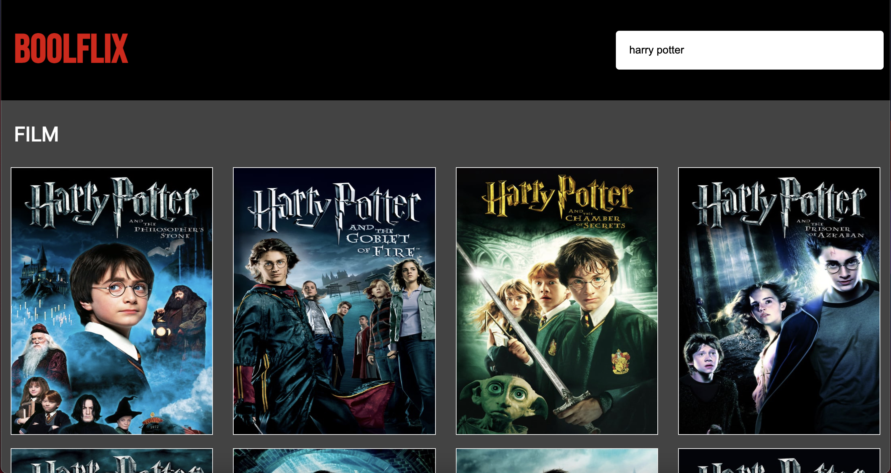
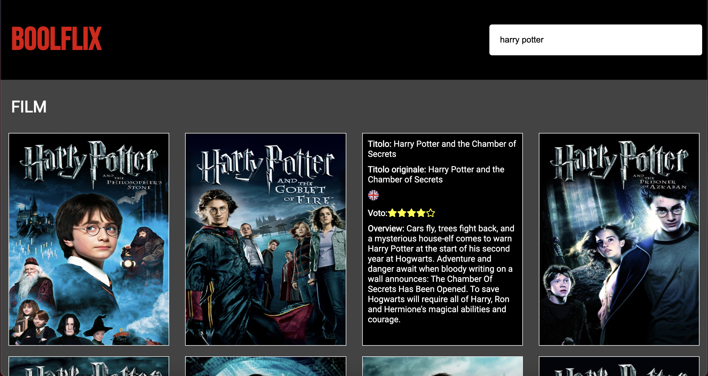

# Netflix con Vue e Axios
## tecnologie
* HTML
* CSS
* JavaScript (Vue) (Axios)
## descrizione
replica, in versione semplificata, di Netflix;
* chiamate AJAX al database di TMDB per la ricerca di film e serie tv
* on hover sulla copertina del film o della serie tv, vengono mostrate informazioni come la valutazione, il titolo, la lingua originale

## crediti
https://www.themoviedb.org/
